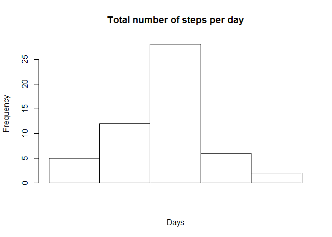
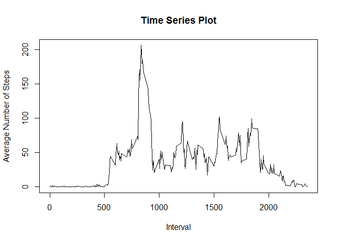
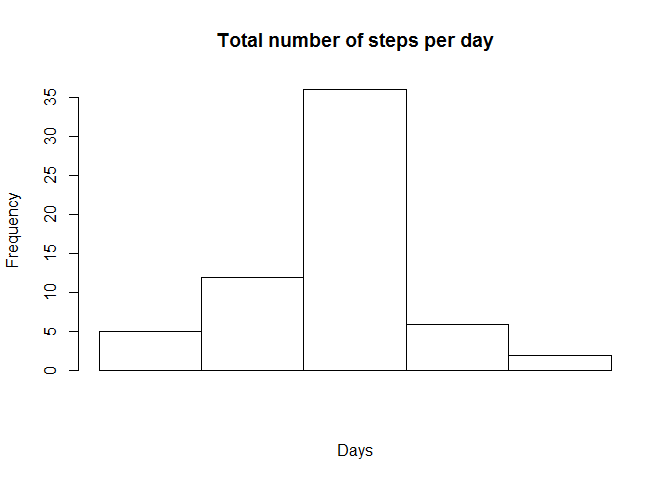

# Reproducible Research: Peer Assessment 1


## Loading and preprocessing the data

```r
dat<-read.csv("activity.csv",stringsAsFactors=F)
options(scipen=100,digits=4)
```


## What is mean total number of steps taken per day?

```r
x<-as.data.frame(tapply(dat$steps,dat$date,FUN=sum))
x<-cbind(x,as.data.frame(tapply(dat$steps,dat$date,FUN=mean)))
x<-cbind(x,as.data.frame(tapply(dat$steps,dat$date,FUN=median)))
colnames(x)<-c("Total Steps","Mean","Median")
x
```

```
##            Total Steps    Mean Median
## 2012-10-01          NA      NA     NA
## 2012-10-02         126  0.4375      0
## 2012-10-03       11352 39.4167      0
## 2012-10-04       12116 42.0694      0
## 2012-10-05       13294 46.1597      0
## 2012-10-06       15420 53.5417      0
## 2012-10-07       11015 38.2465      0
## 2012-10-08          NA      NA     NA
## 2012-10-09       12811 44.4826      0
## 2012-10-10        9900 34.3750      0
## 2012-10-11       10304 35.7778      0
## 2012-10-12       17382 60.3542      0
## 2012-10-13       12426 43.1458      0
## 2012-10-14       15098 52.4236      0
## 2012-10-15       10139 35.2049      0
## 2012-10-16       15084 52.3750      0
## 2012-10-17       13452 46.7083      0
## 2012-10-18       10056 34.9167      0
## 2012-10-19       11829 41.0729      0
## 2012-10-20       10395 36.0938      0
## 2012-10-21        8821 30.6285      0
## 2012-10-22       13460 46.7361      0
## 2012-10-23        8918 30.9653      0
## 2012-10-24        8355 29.0104      0
## 2012-10-25        2492  8.6528      0
## 2012-10-26        6778 23.5347      0
## 2012-10-27       10119 35.1354      0
## 2012-10-28       11458 39.7847      0
## 2012-10-29        5018 17.4236      0
## 2012-10-30        9819 34.0938      0
## 2012-10-31       15414 53.5208      0
## 2012-11-01          NA      NA     NA
## 2012-11-02       10600 36.8056      0
## 2012-11-03       10571 36.7049      0
## 2012-11-04          NA      NA     NA
## 2012-11-05       10439 36.2465      0
## 2012-11-06        8334 28.9375      0
## 2012-11-07       12883 44.7326      0
## 2012-11-08        3219 11.1771      0
## 2012-11-09          NA      NA     NA
## 2012-11-10          NA      NA     NA
## 2012-11-11       12608 43.7778      0
## 2012-11-12       10765 37.3785      0
## 2012-11-13        7336 25.4722      0
## 2012-11-14          NA      NA     NA
## 2012-11-15          41  0.1424      0
## 2012-11-16        5441 18.8924      0
## 2012-11-17       14339 49.7882      0
## 2012-11-18       15110 52.4653      0
## 2012-11-19        8841 30.6979      0
## 2012-11-20        4472 15.5278      0
## 2012-11-21       12787 44.3993      0
## 2012-11-22       20427 70.9271      0
## 2012-11-23       21194 73.5903      0
## 2012-11-24       14478 50.2708      0
## 2012-11-25       11834 41.0903      0
## 2012-11-26       11162 38.7569      0
## 2012-11-27       13646 47.3819      0
## 2012-11-28       10183 35.3576      0
## 2012-11-29        7047 24.4688      0
## 2012-11-30          NA      NA     NA
```

## Histogram of total number of steps taken each day

```r
hist(tapply(dat$steps,dat$date,FUN=sum),main="Total number of steps per day",xaxt='n',xlab="Days")
```

 

## Mean & Median Number of Steps taken each day

```r
mean1<-mean(tapply(dat$steps,dat$date,FUN=sum),na.rm=T)
median1<-median(tapply(dat$steps,dat$date,FUN=sum),na.rm=T)
mean1
```

```
## [1] 10766
```

```r
median1
```

```
## [1] 10765
```
The mean of the total number of steps taken per day is 10766.1887.  
The median of the total number of steps taken per day is 10765.

## What is the average daily activity pattern?

```r
time_series<-tapply(dat$steps,dat$interval,mean,na.rm=T)
plot(x=unique(dat$interval),y=time_series,type="l",main="Time Series Plot",xlab="Interval",ylab="Average Number of Steps")
```

 

### Which 5-minute interval that, on average, contains the maximum number of steps?

```r
max_steps<-as.numeric(names(which.max(time_series)))
max_steps
```

```
## [1] 835
```
The 5-minute interval that contains the maximum number of steps is 835.

## Imputing missing values

### Calculate and report the total number of missing values in the dataset

```r
missing<-sum(is.na(dat))
missing
```

```
## [1] 2304
```
The number of rows with NA is 2304.

### Strategy for filling in the missing values
Fill in missing values with mean for 5-minute interval, the assumption is that the number of steps taken in the 5-minute interval can be well approximated by the mean which is found in the time_series data.  

```r
dat1<-dat
for (i in 1:nrow(dat1)){
    if (is.na(dat1[i,1])==TRUE){
        dat1[i,1]<-time_series[paste(dat1$interval[i])]
        }
}
```
dat1 is the new dataset with missing data filled in.  

### Histogram of the total number of steps taken each day with NA values filled in

```r
hist(tapply(dat1$step,dat1$date,sum),main="Total number of steps per day",xaxt='n',xlab="Days")
```

 

### Mean and Median of total number of steps taken per day###

```r
mean2<-mean(tapply(dat1$step,dat1$date,sum))
median2<-median(tapply(dat1$step,dat1$date,sum))
mean2
```

```
## [1] 10766
```

```r
median2
```

```
## [1] 10766
```
The mean 10766.1887 and median 10766.1887 here is about the same as the first part of the assignment. Since we impute data with the mean, the distribution of the histogram stays about the same.

## Are there differences in activity patterns between weekdays and weekends?

### Creating the factor variable

```r
if (!require(timeDate)){
    install.packages("timeDate")
}
library(timeDate)
dat1$day<-ifelse(isWeekend(dat1$date),"Weekend","Weekday")
```

### Differences in activity patterns between weekdays and weekends?


```r
if (!require(lattice)){
    install.packages("lattice")
}
library(lattice)

dat2<-data.frame(interval=unique(dat1$interval),step=tapply(dat1$steps[dat1$day=="Weekday"],dat1$interval[dat1$day=="Weekday"],mean),day="Weekday")
rownames(dat2)<-1:nrow(dat2)

dat3<-data.frame(interval=unique(dat1$interval),step=tapply(dat1$steps[dat1$day=="Weekend"],dat1$interval[dat1$day=="Weekend"],mean),day="Weekend")
rownames(dat3)<-nrow(dat2)+1:nrow(dat2)+nrow(dat3)

dat4<-rbind(dat2,dat3)

xyplot(step~interval|day, data=dat4,layout=c(1,2),type="l",ylab="Number of steps",xlab="Interval")
```

 

The panel plot that shows the average number of steps for each interval.
